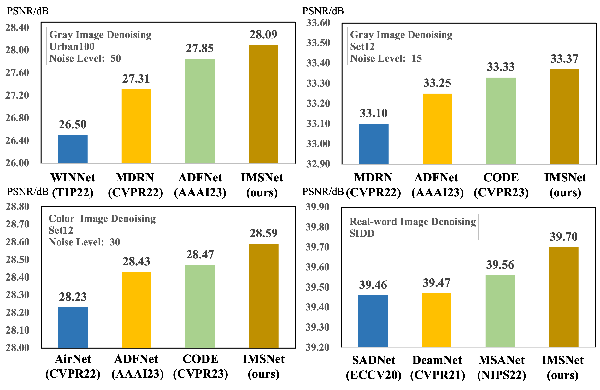
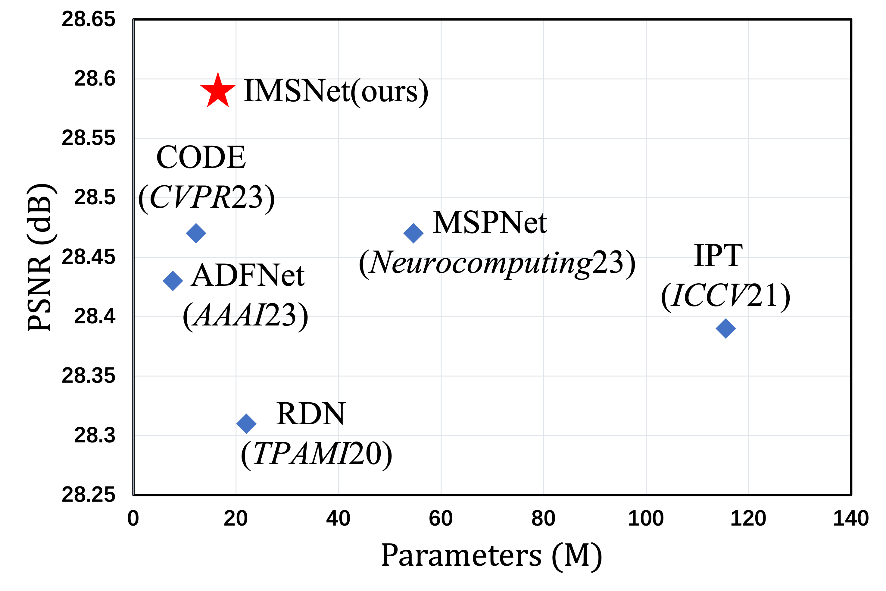
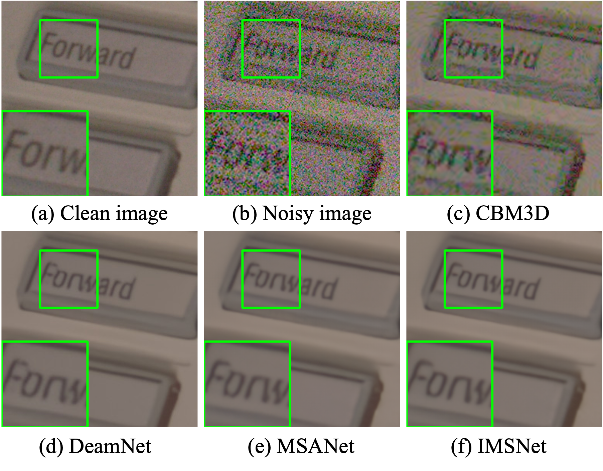
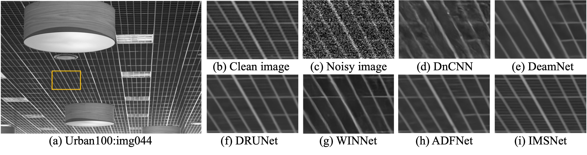
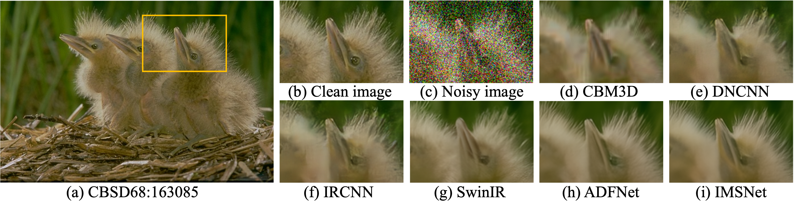

# Implicit multi-scale swin Transformer network for image denoising
This repository is for IMSNet
## Network

Network is coming...

## Performance

### PSNR vs. Parameters

## Real world image denoising

### SIDD Dataset

## Synthetic image denoising

### Urban100 Dataset

### CBSD68 Dataset

### Heat Map

The source code is coming...
